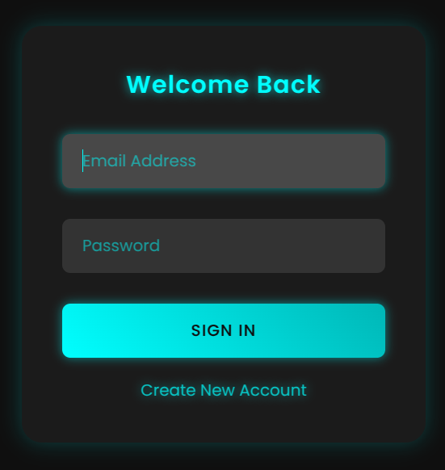

# JS form Validasi Regis-Login

Desain sederhana Form Regis dan login

## Tampilan



## Importan!!!
isi ke file css

```bash
* {
    margin: 0;
    padding: 0;
    box-sizing: border-box;
    font-family: 'Poppins', sans-serif;
}

body {
    display: flex;
    justify-content: center;
    align-items: center;
    min-height: 100vh;
    background: #0f0f0f;
    overflow: hidden;
}

.container {
    position: relative;
    width: 400px;
    padding: 40px;
    background: rgba(255, 255, 255, 0.05);
    border-radius: 20px;
    box-shadow: 0 0 20px rgba(0, 255, 255, 0.2);
    backdrop-filter: blur(10px);
    transition: all 0.5s ease;
    overflow: hidden;
    animation: glow 3s infinite alternate;
}

@keyframes glow {
    0% { box-shadow: 0 0 20px rgba(0, 255, 255, 0.2); }
    100% { box-shadow: 0 0 40px rgba(0, 255, 255, 0.6); }
}

.container h2 {
    color: #00ffff;
    text-align: center;
    margin-bottom: 30px;
    font-weight: 600;
    letter-spacing: 1px;
    text-shadow: 0 0 10px rgba(0, 255, 255, 0.7);
}

.input-group {
    position: relative;
    margin-bottom: 30px;
}

.input-group input {
    width: 100%;
    padding: 15px 20px;
    border: none;
    background: rgba(255, 255, 255, 0.1);
    border-radius: 8px;
    font-size: 16px;
    color: #00ffff;
    transition: all 0.3s ease;
}

.input-group input:focus {
    outline: none;
    box-shadow: 0 0 10px rgba(0, 255, 255, 0.5);
    background: rgba(255, 255, 255, 0.2);
}

.input-group input::placeholder {
    color: rgba(0, 255, 255, 0.5);
}

button {
    width: 100%;
    padding: 15px;
    background: linear-gradient(45deg, #00ffff, #00b7b7);
    border: none;
    border-radius: 8px;
    color: #0f0f0f;
    font-size: 16px;
    font-weight: 500;
    cursor: pointer;
    transition: all 0.3s ease;
    text-transform: uppercase;
    letter-spacing: 1px;
    box-shadow: 0 0 10px rgba(0, 255, 255, 0.5);
}

button:hover {
    transform: translateY(-2px);
    box-shadow: 0 0 20px rgba(0, 255, 255, 0.7);
}

button:active {
    transform: translateY(0);
}

.toggle {
    text-align: center;
    color: rgba(0, 255, 255, 0.7);
    margin-top: 20px;
    cursor: pointer;
    transition: all 0.3s ease;
    text-shadow: 0 0 10px rgba(0, 255, 255, 0.5);
}

.toggle:hover {
    color: #00ffff;
    transform: translateY(-2px);
}

.error {
    color: #ff0066;
    font-size: 14px;
    margin-top: 5px;
    animation: shake 0.5s ease;
    text-shadow: 0 0 10px rgba(255, 0, 102, 0.5);
}

@keyframes shake {
    0%, 100% { transform: translateX(0); }
    25% { transform: translateX(5px); }
    75% { transform: translateX(-5px); }
}

.container-switch {
    animation: containerSwitch 0.6s ease;
}

@keyframes containerSwitch {
    0% { transform: translateX(200%); opacity: 0; }
    100% { transform: translateX(0%); opacity: 1; }
}

.container-out {
    animation: containerOut 0.6s ease;
}

@keyframes containerOut {
    0% { transform: translateX(0); opacity: 1; }
    100% { transform: translateX(-200%); opacity: 0; }
}
```
